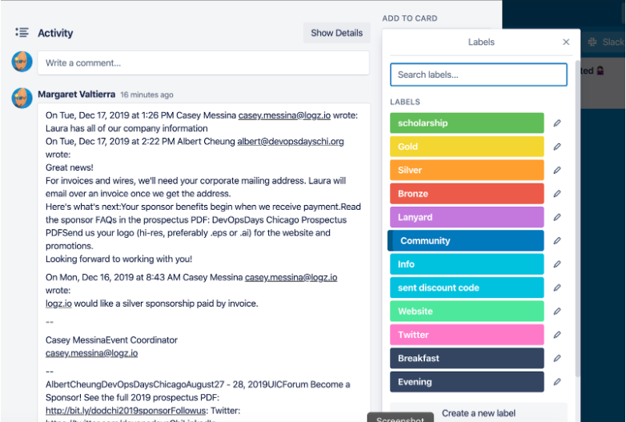

# Responsibilities of all sponsorship committee members

## Reply to all inbound emails for sponsor requests

- [Follow templates in Drive](https://drive.google.com/open?id=1eNnu2klIXmfJzl0H4p8IE3RXXCzkNiBZQ3sNjDyVZQ4). If in doubt, chat with other organizers in Slack

- Reply to the email, cc sponsorships <chicago-sponsors@devopsdays.org> for transparency

- To pay, they can pay directly via the website using a credit card, or to create an invoice and/or get a new W9 email Laura: <laura@conferenceops.com>

- Ask for a hi-res logo for website / slides

- Follow up with updates as needed, but tell them the big email for sponsors will be ~2weeks before event

- Update Trello card with any new contact info, sponsor level tag/text, and again as they're added to the website and social calendar

## Contact previous sponsors until you hear "no"

- Work through a list in Trello, such as "2020 new / needs work 🕵🏻‍♀: <https://trello.com/b/RYTq2DG2/sponsorship>

- [Follow templates in Drive](https://drive.google.com/open?id=1eNnu2klIXmfJzl0H4p8IE3RXXCzkNiBZQ3sNjDyVZQ4). If in doubt, chat with other organizers in Slack

- Follow up every 3-4 weeks until you hear no

- If/when you hear updates, move card to new list such as "Interested" or "2020 Paid"

- Update Trello card with any new contact info (if email bounces, they cc new people, etc).

- If they reply and want to sponsor, add Trello tags for sponsor level tag/text, and again as they're added to the website and social calendar

<i><b>Example</b> - Logz.io contacted us. Albert replied and cc’d the group. Email thread added to ‘activity’ and Card moved to “2020 Interested”. Once they pay, they will be tagged Silver. Once their logo is on the website, add tag Silver. Once Tweets are scheduled, add tag Twitter.</i>

## Find new, local sponsors from the community

- Start with Trello lists like "2020 local" or :2020 new / needs work 🕵🏻‍♀️" Search for new contact info for people/companies.

- Update Trello with new contact info and if you get replies.

- [Follow templates in Drive](https://drive.google.com/open?id=1eNnu2klIXmfJzl0H4p8IE3RXXCzkNiBZQ3sNjDyVZQ4). If in doubt, chat with other organizers in Slack

- Reply to the email, cc sponsorships chicago-sponsors@devopsdays.org for transparency

- Follow up when CFP is open and ask for local submissions

- Follow up when registration is open and ask for local attendees

## Sponsorship committee guidelines

- Specify only what comes with the sponsorship and do not negotiate for special deals.

- Remind sponsors repeatedly about global DevOpsDays rules such as no sponsored talks and contact information is never shared. See <https://devopsdays.org/organizing> for more.

- Be consistent about what comes with sponsorships.

- There is no such thing as too much communication!
